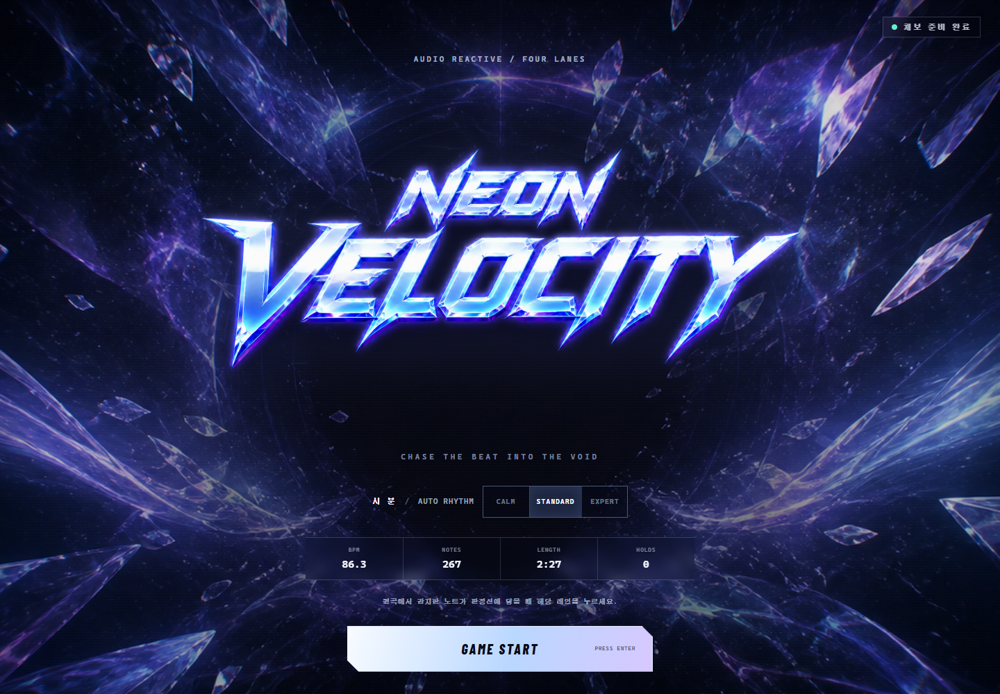

# Neon Velocity

MP3 또는 MIDI를 분석해 4레인 노트 데이터로 바꾸고, 생성된 채보를 바로 플레이할 수 있는 브라우저 리듬 게임입니다. Three.js 기반의 네온 우주 무대, 원곡 동기 재생, 실시간 판정·콤보·정확도, 키보드와 터치 입력을 지원합니다.

**라이브 데모:** [neon-velocity-midi-game.vercel.app](https://neon-velocity-midi-game.vercel.app/)



## 게임 특징

- `D`, `F`, `J`, `K` 4레인 플레이와 모바일 터치 입력
- `PERFECT ±60ms`, `GREAT ±120ms`, `GOOD ±180ms`, 그 밖은 `MISS` 판정
- 점수, 콤보, 정확도, 최근 판정 기록 표시
- MP3 원곡 재생과 자동 채보 동기화
- MIDI 음원은 Web Audio 기반 신시사이저로 실시간 재생
- MIDI의 0.5초 이상 노트는 홀드 노트로 변환
- `CALM`, `STANDARD`, `EXPERT` 세 단계 노트 밀도
- 생성 결과를 재사용 가능한 JSON 채보로 내보내기
- 반응형 화면, 블룸·파티클·히트 이펙트 및 카메라 셰이크

## 빠른 실행

Node.js 20 이상을 권장합니다.

```powershell
npm install
npm run dev
```

터미널에 표시되는 주소를 브라우저에서 연 뒤 `GAME START` 또는 `Enter`를 누릅니다. 게임 화면에서도 `Enter`로 다시 시작할 수 있습니다.

## MP3를 노트 데이터로 변환

명령줄 변환에는 [FFmpeg](https://ffmpeg.org/)가 필요합니다. 입력 MP3를 44.1kHz 모노 PCM으로 디코딩한 다음, 브라우저와 동일한 자동 채보 엔진으로 JSON을 만듭니다.

```powershell
npm run audio:notes -- "public/audio/neon-velocity-track.mp3" "output/시_분.standard.chart.json" standard
```

출력 경로를 생략하면 `output/<파일명>.<난이도>.chart.json`에 저장됩니다.

```powershell
npm run audio:notes -- "music/my-song.mp3"
npm run audio:notes -- "music/my-song.mp3" "output/my-song.expert.chart.json" expert
```

난이도는 `calm`, `standard`, `expert` 중 하나입니다. 분석 요약과 앞부분 노트만 확인하려면 아래 명령을 사용합니다.

```powershell
npm run audio:analyze -- "public/audio/neon-velocity-track.mp3" standard
```

MP3 변환은 음을 악보처럼 채보하는 음정 인식이 아니라, 파형의 저·중·고역 에너지 변화에서 타격 시점을 찾는 방식입니다. 따라서 결과는 곡의 믹싱과 리듬 선명도에 영향을 받습니다. 세부 단계와 조절 기준은 [MP3 자동 채보 로직](docs/mp3-to-note-data.md)에 정리했습니다.

## MIDI를 노트 데이터로 변환

```powershell
node scripts/generate_note_data.mjs input.mid output.chart.json standard "Track Name"
```

트랙 이름 대신 MIDI 트랙 인덱스를 지정할 수 있습니다. 트랙을 생략하면 멜로디·리드 계열 이름과 적절한 노트 수를 기준으로 플레이할 트랙을 자동 선택합니다.

## 채보 JSON 구조

```json
{
  "version": 2,
  "meta": {
    "title": "시_분",
    "bpm": 86.3,
    "duration": 147.357,
    "difficulty": "STANDARD",
    "laneCount": 4,
    "keys": ["D", "F", "J", "K"],
    "analysisType": "audio-onset"
  },
  "notes": [
    {
      "id": "n0001",
      "time": 0.4005,
      "endTime": 0.4905,
      "type": "tap",
      "lane": 3,
      "pitch": 84,
      "velocity": 0.582
    }
  ]
}
```

`time`과 `endTime`은 초 단위이며, `lane`은 왼쪽부터 `0`~`3`입니다. MP3에서 생성한 `pitch`는 실제 음정이 아니라 레인별 호환 값입니다.

## 프로젝트 구성

```text
src/
  audio-chart-generator.js  MP3 파형 → 4레인 채보 핵심 알고리즘
  chart-generator.js        MIDI → 채보 및 JSON 직렬화
  midi-synth.js             Web Audio 재생·신시사이저
  rhythm-game.js            Three.js 렌더링·판정·점수 처리
  main.js                   파일 분석, 화면, 게임 상태 연결
scripts/
  audio-file-to-chart.mjs   FFmpeg 디코딩과 공용 변환 어댑터
  generate_audio_note_data.mjs  MP3 → JSON 명령줄 도구
  generate_note_data.mjs    MIDI → JSON 명령줄 도구
tests/                      자동 채보 단위 테스트
public/                     게임 음원·이미지·기본 채보 자산
docs/                       화면과 설계 문서
```

## 검사

```powershell
npm test
npm run build
```

로컬 개발 서버가 실행 중이면 데스크톱·모바일 브라우저 검증도 실행할 수 있습니다.

```powershell
$env:MIDI_GAME_URL = "http://127.0.0.1:5173/"
npm run verify:browser
```

## 참고

`public/audio/neon-velocity-track.mp3`는 게임 화면에 `시_분.mp3`로 표시되는 현재 데모 원본 음원입니다. 저장소를 공개하거나 음원을 재배포하기 전에는 해당 파일의 이용·배포 권리를 확인해 주세요.
